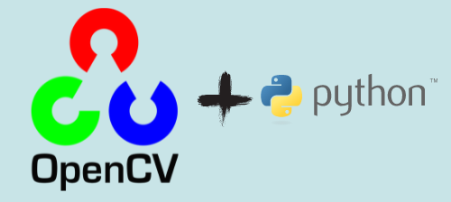

 
 

## 🚨 Forking this repo (please read!)

_**yes, with attribution**_.

I value keeping my work open source, but as you all know, _**plagiarism is bad**_. It's always disheartening whenever I find that someone has copied my work without giving me credit. I spent a non-trivial amount of effort building and designing this project, and I am proud of it! All I ask of you all is to not claim this effort as your own.

### TL;DR

Yes, you can fork this repo. Please give me proper credit by linking back to [Abhijith14/OpenCV-projects](https://github.com/Abhijith14/OpenCV-projects). Thanks!