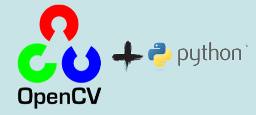

<h1 align="center">
  Volume Control using Hand Tracking
</h1>
<p align="center">
  A project done using opencv and mediapipe
</p>

<center>



</center>

<br>
<br>


## 📕 Installation

### 🕷️ Create an environment
Whatever you prefer (e.g. `conda` or `venv`)
```console
mkdir myproject
$ cd myproject
$ python3 -m venv venv
```

### 🕷️ Activate it
Windows:
```console
venv\Scripts\activate
```
Mac / Linux:
```console
. venv/bin/activate
```
### 🕷️ Install Dependencies

You need `opencv-python`, `mediapipe` and `pycaw` :
 ```console
pip install opencv-python
pip install mediapipe
pip install pycaw
 ```

## 👨‍💻 Usage
Run
```console
python VolumeControl.py
```
This will start opencv video capture. Remember to check the customize section below if you get into any error.<br>

<br>
<center>

</center>
<br>


## ⚙️ Customize
Have a look at [VolumeControl.py](VolumeControl.py). <br>
Change the camera id (If you have multiple cameras). Default is 0.
```
cap = cv2.VideoCapture(0)
```
Width and Height for img
```
################################
wCam, hCam = 640, 480
################################
```

<br>


### 🛠️ Built With

* [Python 3.7](https://www.python.org/) - Creating Project


### ❤️ Authors

* **Abhijith Udayakumar** - *Design & Development* - [Abhijith14](https://github.com/Abhijith14)

<br>
<br>

## 🚨 Forking this repo (please read!)

_**yes, with attribution**_.

I value keeping my work open source, but as you all know, _**plagiarism is bad**_. It's always disheartening whenever I find that someone has copied my work without giving me credit. I spent a non-trivial amount of effort building and designing this project, and I am proud of it! All I ask of you all is to not claim this effort as your own.


### TL;DR

Yes, you can fork this repo. Please give me proper credit by linking back to [Abhijith14/OpenCV-projects](https://github.com/Abhijith14/OpenCV-projects). Thanks!